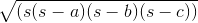
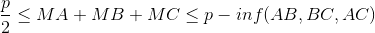

# TP5 : Héritage

### Objectif
Utilisé l'héritage dans le cadre de la POO

- Sous-classe
- Classe Abstraite
- Interface

### Prérequis
- Cloner le projet sur votre poste dans le repertoire de votre choix
- Ouvrir le projet USSI2A-TP5
    - File > New > Project from Exiting Sources (ou *Import Project* si vous êtes sur l'écran d'accueil)
    - Selectionner le dossier du projet
    - Selectionner **Create project from existing sources**
    - Conserver les informations (*Nom, Location, Format*)
    - IntelliJ détecte que c'est un projet Java
    - Aucune bibliothèque n'est integtée au projet
    - Choisir JDK14, s'il n'est pas dans la liste, cliquer sur le <span style="color:green">**+**</span> et selectionner le dossier du JDK 14
    - Aucun Framework n'est detecté
    - Aller dans File > Project Structure et Choisir 14 dans **Project language level**  

### Utilisation de GIT

- Créer une nouvelle branche **prenomNom**
- Faire **1 commit** par exercice
- Ouvrir **une seule** *pull request* sur github et **ne pas** la fermer/merger !!

----

### Exercice 0

On repart de la fin du TP3 (hors bonus) avec les 3 classes Dessin, Rectangle et Point ainsi que la classe Exec pour vos tests

### Exercice 1

On considère maintenant que les rectangles ne sont plus nécessairement parallèles aux axes. Un rectangle incliné est un rectangle avec un angle (en degrés)

Créer une classe **RectangleIncline** qui hérite de **Rectangle** avec une propriété *angle* et les constructeurs appropriés 

> Pensez a faire un commit !!  

### Exercice 2

Dans la classe **RectangleIncline**, définir une méthode **rotation(int)** qui permet de modifier l'angle du rectangle en **ajoutant** la valeur passée en paramètre à l'angle du rectangle.

> Pensez a faire un commit !!  


### Exercice 3
Redefinir les méthodes de la classe **RectangleIncline** qui le nécessitent (On veut connaitre l'angle du rectangle s'il est incliné lorsqu'on affiche les informations du rectangle...)   
Pour savoir si un point est dans un rectangle incliné, vous pouvez utiliser le code suivant :

```java
double rotx =  p.x * Math.cos(this.angle) - p.y * Math.sin(this.angle);
double roty = -p.x * Math.sin(this.angle) + p.y * Math.cos(this.angle);
return (this.point.x <= rotx && rotx <= this.point.x + this.longeur &&
        this.point.y <= roty && roty <= this.point.y + this.largeur);
```

> Pensez a faire un commit !!  

### Exercice 4
Si besoin, modifier la classe Dessin pour qu'on puisse ajouter des rectangles inclinés. 

> Pensez a faire un commit !!  

### Exercice 5
Effacer vos tests de la méthode **main()** de la classe **Exec** et :
  - Instancier un objet Dessin
  - Ajouter plusieurs rectangles (droits et inclinés)
  - Afficher la surface totale des rectangles
  - Afficher les informations (toString()) du plus grand rectangle

> Pensez a faire un commit !!  


### Exercice 6
On ajoute une nouvelle figure : **les disques**, un disques est caractérisé par son centre et son rayon.  
Créer une classe **Disque** avec les constructeurs adaptés ainsi que les méthodes :
- **translate(double x, double y)** : Deplace le disque
- **retourneSurface()** : Calcul et retourne la surface du disque
- **contient(Point)** : Retourne vrai si le point est dans le disque. 
- **toString()** : Retourne une chaine qui décrit le disque.

> Pensez a faire un commit !!  


### Exercice 7
Modifier la classe **Dessin** pour qu'on puisse ajouter des **Disques** en plus des **Rectangles**. Attention, il ne faut pas rajouter un nouveau tableau et une nouvelle méthode, il faut modifier les éléments actuels pour qu'il soit possible d'ajouter aussi bien un **Disque** qu'un **Rectangle**.
Penser à modifier la méthode qui retourne le plus grand rectangle pour qu'elle retourne la plus grande figure

> Pensez a faire un commit !!  


### Exercice 8
Dans la méthode **main()** de la classe **Exec**,  sans effacer l'exercice 5 :
  - Ajouter plusieurs Disques
  - Afficher la surface totale des Figures
  - Afficher les informations de la plus grande figure

> Pensez a faire un commit !!  

### Exercice 9
Ajouter des **Triangles** (*spoiler alerte : c'est la dernière figure or bonus...*) (implique toute ce qu'il faut pour que le triangle soit une figure..). Un triangle est définit par 3 points

- Pour calculer la surface d'un triangle sans connaitre sa hauteur, on peut utiliser la formule du héron ci dessous où **s** est le demi périmètre et a, b, c la longueur de chaque coté.




- Pour savoir si un point **M** appartient à un triangle, vous pouvez utiliser le théorème suivant où p est le périmère :




**Pensez à décomposer avec des méthodes privées (calcul des coté, du périmètre, etc...) et à réutiliser les méthodes existantes (pour calculer la longueur des cotés par exemple)**  


> Pensez a faire un commit !!  

### Exercice 10
Dans la méthode **main()** de la classe **Exec**,  sans effacer l'exercice 5 :
  - Ajouter plusieurs Triangles
  - Afficher la surface totale des Figures
  - Afficher les informations de la plus grande figure

> Pensez a faire un commit !!  
> Pensez à faire un push (```git push origin nomPrenom```)  
> Si elle n'est pas déjà ouverte, ouvrez une pull request (branche **prenomNom** vers **master**) NE PAS LA FERMER/MERGER !


### Exercice 11 (bonus)
Rajouter les classes carré du TP3...

### Exercice 12 (bonus)
Ajouter une classe quadrilatere à votre projet et modiifier les classes qui le nécessitent

----
### Problème (bonus)

Avant de commencer
> Aller sur la branche **master** (``` git checkout master```) Vos exercices précédents "disparaissent", c'est normal ! Ils ne sont pas sur Master  
> Créer une nouvelle branch **feature/avion**  
> Pensez a faire des commit unitaires et réguliers  !!  

Considéront un **Avion** :
- il a une *envergure* (double)
- il a une *largeur d'aile moyenne* (*On parle de corde moyenne*) (double)

Un **Cessna 150**
- envergure : 10,11 m
- corde moyenne : 1,46 m
- roule
- vol
- on peut calculer la surface de ses ailes (*On parle de surface alaire*)
- on peut afficher ses caracteristiques (envergure, corde, surface alaire)

Un **avion en papier**
- envergure : 19,2 cm
- corde moyenne : 14 cm
- ne roule pas
- vol
- on peut calculer la surface de ses ailes
- on peut afficher ses caracteristiques (envergure, corde, surface alaire)

Une **maquette d'avion**
- envergure : 10,11 cm
- corde moyenne : 1,46 cm
- ne roule pas
- ne vol pas
- on peut calculer la surface de ses ailes
- on peut afficher ses caracteristiques (envergure, corde, surface alaire)

Chaque action ne retourne rien mais doit afficher un message, **ne rien afficher** si l'action ne se produit pas.


###   Exercice
En utilisant le pattern *Strategy*, créer les classes et interfaces pour qu'on puisse executer le code suivant  afin qu'il nous retourne les caractéristiques et actions de l'avion :

```java
public static void main(String[] args) {
    Avion avions[] = {new Cessna150(), new AvionPapier(), new MaquetteAvion()}
    System.out.println("------------------");
    for (Avion a : avions) {
        System.out.println(a.toString());
        a.rouler();
        a.voler();
        System.out.println("------------------");
    }
}    
```

> Pensez a faire un commit !!  
> Pensez à faire un push (```git push origin feature/avion```)  
> Si elle n'est pas déjà ouverte, ouvrez une pull request (branche **feature/avion** vers **master**) NE PAS LA FERMER/MERGER !
